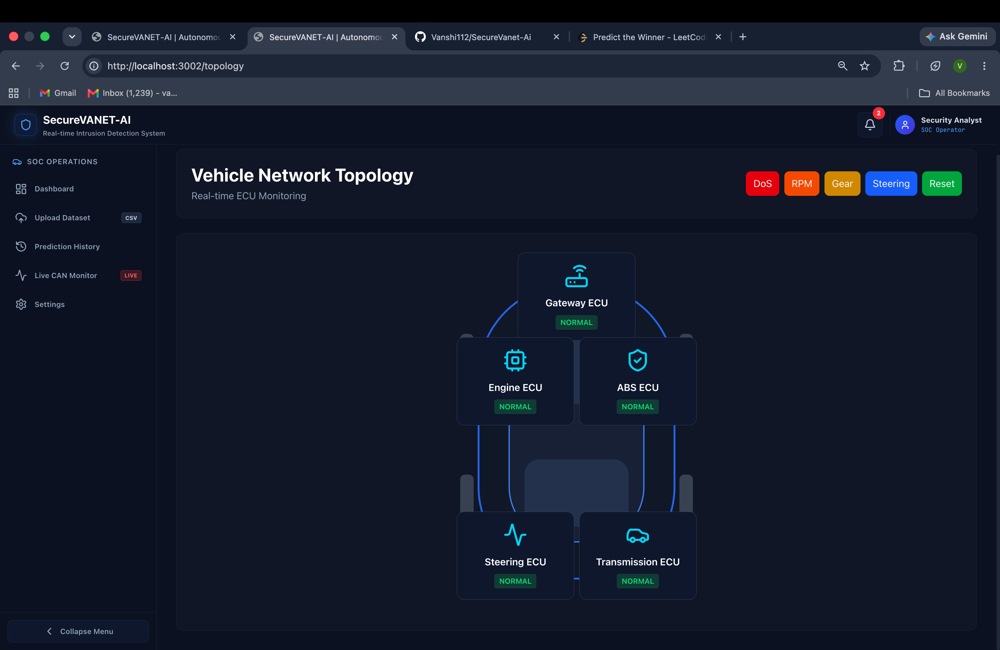

# SecureVANET-AI


An AI-powered Intrusion Detection System (IDS) for Vehicular Ad-Hoc Networks (VANETs) that combines deep learning with real-time CAN bus monitoring to detect cyberattacks on connected vehicles. SecureVANET-AI supports both offline analysis of CAN datasets and live monitoring through SocketCAN, providing an interactive Security Operations Center (SOC) dashboard for visualising threats and system health.

---

# Table of Contents

- [Project Description](#project-description)
- [Features](#features)
- [Demo--Screenshots](#demo--screenshots)
- [Tech Stack](#tech-stack)
- [Project Architecture](#project-architecture)
- [Installation](#installation)
- [Usage](#usage)
- [Dataset](#dataset)
- [Folder Structure](#folder-structure)
- [Results](#results)
- [Future Improvements](#future-improvements)
- [Contributing](#contributing)
- [License](#license)
- [Author](#author)

---
# Project Description

Modern vehicles rely on the Controller Area Network (CAN) protocol for communication between Electronic Control Units (ECUs). While lightweight and efficient, the protocol lacks built-in authentication and encryption, making it vulnerable to attacks such as Denial of Service (DoS), Fuzzy Injection and Spoofing attacks.

SecureVANET-AI addresses this problem using a Transformer-based deep learning model capable of classifying CAN traffic into multiple attack categories. The system provides an end-to-end solution consisting of:

- Deep learning-based intrusion detection
- FastAPI backend for inference
- PostgreSQL database for prediction history
- Modern React-based Security Operations Center (SOC) dashboard featuring live telemetry, attack    simulation, vehicle network topology visualization, and real-time CAN bus monitoring. 
- Real-time CAN bus monitoring using SocketCAN
- Interactive analytics and visualisation

The project was developed with the goal of demonstrating how AI can be applied to strengthen the cybersecurity of intelligent transportation systems.

---

# Features

### Machine Learning

- Transformer + BiLSTM + Attention architecture
- Multiclass attack classification
- Sequence-based prediction
- Feature engineered CAN dataset
- High-speed inference

### Attack Detection

Supported attack classes:

- Normal Traffic
- DoS Attack
- Fuzzy Attack
- Gear Spoofing Attack
- RPM Spoofing Attack

Each detected attack is visualized in real time on the dashboard, prediction history, and vehicle network topology.

### Backend

- FastAPI REST API
- PostgreSQL integration
- Prediction history
- CSV upload support
- Automatic report generation

### Frontend

- Modern SOC dashboard
- Responsive design
- Live analytics
- Vehicle Network Topology Visualization
- Attack Simulation Panel
- Interactive Vehicle Telemetry
- Real-time Notifications
- Network Topology Attack Mapping
- Interactive charts
- Upload interface
- Prediction history
- System health monitoring
- Real-time CAN monitoring

### Live Monitoring

- SocketCAN integration
- WebSocket streaming
- Vehicle Telemetry Dashboard
- ECU Network Topology
- Live WebSocket Streaming
- Simulated & Real CAN Monitoring Modes
- Live Attack Simulation
- Live packet inspection
- Threat severity indicators
- Real-time attack alerts

---

# Demo / Screenshots

## Dashboard

> *Add dashboard screenshot here*

---

## Upload Dataset

> *Add upload page screenshot here*

---

## Prediction History

> *Add history page screenshot here*

---

## Live CAN Monitoring

> *Add live monitoring screenshot here*

---


# Tech Stack

## Frontend

- React 19
- TypeScript
- Vite
- Tailwind CSS
- Axios
- React Router
- Framer Motion
- Recharts
- Lucide React

## Backend

- FastAPI
- SQLAlchemy
- PostgreSQL
- Pydantic

## Machine Learning

- PyTorch
- NumPy
- Pandas
- Scikit-learn

## Tools

- SocketCAN
- Git
- Docker (optional)

---

# Project Architecture

```
                    CAN Traffic
                         │
          ┌──────────────┴──────────────┐
          │                             │
     CSV Upload                  Live SocketCAN
          │                             │
          └──────────────┬──────────────┘
                         │
               Feature Engineering
                         │
       Transformer + BiLSTM + Attention
                         │
                Prediction Engine
                         │
        ┌────────────────┴────────────────┐
        │                                 │
   PostgreSQL Database             FastAPI Backend
        │                                 │
        └────────────────┬────────────────┘
                         │
                 React SOC Dashboard

# Installation

## Clone the repository

```bash
git clone https://github.com/vanshi112/SecureVANET-AI.git

cd SecureVANET-AI
```

## Backend Setup

```bash
cd backend

python -m venv venv

source venv/bin/activate

pip install -r requirements.txt

uvicorn app.main:app --reload
```

The backend will start on:
```
http://localhost:8000
```
---

## Frontend Setup

```bash
cd frontend

npm install

npm run dev
```

The frontend will be available at:

```
http://localhost:3000
```

# Vehicle Network Topology

SecureVANET-AI includes an interactive vehicle topology that visualizes critical Electronic Control Units (ECUs) within the CAN network.

### ECUs

- Gateway ECU
- Engine ECU
- ABS ECU
- Steering ECU
- Transmission ECU

Attack Mapping

| Attack | Target ECU |
|----------|------------|
| DoS | Gateway ECU |
| RPM | Engine ECU |
| Gear | Transmission ECU |
| Steering | Steering ECU |

The topology dynamically highlights the affected ECU whenever an attack is detected, providing an intuitive representation of cyber threats across the in-vehicle network.
---

# Usage

## Offline Detection

1. Start the backend server.
2. Open the frontend.
3. Navigate to **Upload Dataset**.
4. Upload a CAN traffic CSV file.
5. View the prediction results and generated report.

---

## Live Monitoring

1. Configure a SocketCAN interface.
2. Open the **Live CAN Monitor** page.
3. Switch to **Real Mode**.
4. Monitor incoming CAN frames in real time.
5. Observe attack alerts, packet classification and telemetry.
---

# Dataset

The model was trained on a multiclass CAN intrusion dataset containing the following categories:

- Normal
- DoS
- Fuzzy
- Gear
- RPM

The dataset undergoes feature engineering and sequence generation before being passed to the Transformer-based classifier.
---

# Folder Structure

```
SecureVANET-AI/

├── backend/
│   ├── app/
│   ├── database/
│   ├── models/
│   └── schemas/
│
├── frontend/
│   ├── src/
│   ├── public/
│   └── assets/
│
├── ml/
│   ├── models/
│   ├── training/
│   ├── feature_engineering/
│   └── inference/
│
├── datasets/
│
├── docs/
│
├── requirements.txt
├── package.json
└── README.md
```

---

# Results

Current implementation includes:

- Transformer + BiLSTM + Attention IDS
- Multiclass CAN attack detection
- Vehicle Network Topology
- Live Attack Simulation
- Interactive SOC Dashboard
- Live WebSocket Streaming
- Real-time CAN Telemetry
- Prediction History
- Dataset Upload & Analysis
- PostgreSQL Storage

---

# Future Improvements

- Digital Twin Vehicle Visualization
- Real Vehicle ECU Integration
- SHAP-based Explainable AI
- Multi-Vehicle Fleet Monitoring
- Edge Deployment on Raspberry Pi / NVIDIA Jetson
- OTA Model Updates

---

# Contributing

Contributions are always welcome.

If you would like to improve the project, feel free to fork the repository, create a new branch, and submit a pull request. Bug reports, feature requests, and suggestions are also appreciated.

---

# Project Highlights

- 🚗 AI-powered Intrusion Detection System for VANETs
- 🧠 Transformer + BiLSTM + Attention Deep Learning Model
- ⚡ Real-time CAN Bus Monitoring
- 📡 WebSocket-based Live Telemetry Streaming
- 🛰️ Interactive Vehicle Network Topology
- 🔥 Real-time Attack Simulation
- 📊 Security Operations Center (SOC) Dashboard
- ⚙️ FastAPI + React Full Stack Architecture

# License
This project is licensed under the MIT License.
---

# Author

## VANSHIKA SHARMA 

**B.Tech Computer Science Engineering**  
Netaji Subhas University of Technology (NSUT)

**GitHub**  
https://github.com/vanshi112

**LinkedIn**  
https://www.linkedin.com/in/vanshika-sharma-70bb2b288/

---

If you found this project helpful or interesting, consider giving it a ⭐ on GitHub.